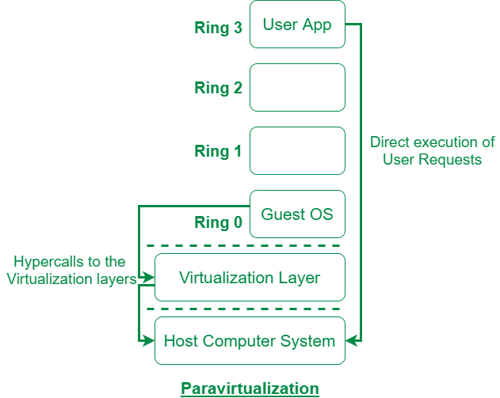
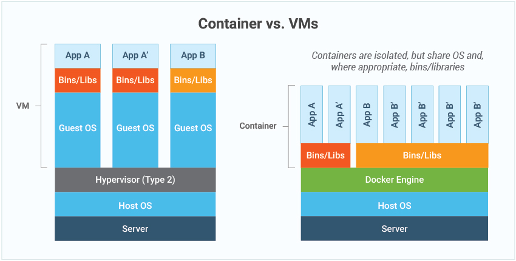

# VM vs Container

1. **Explain Working mechanism of Virtual Machine.**

Virtual Machines are a type of hardware level virtualization and they are two types:

- Full-virtualization: VMWare esxi, xen, kvm, etc
- Para-virtualization: Oracle Virtualbox, VMWare Workstation

    

(Image Source: GeekforGeeks)

In para there is no system call instead  a hypercall is made but in full virtualization we have system calls which are trapped by the hypervisor and emulated.

Full virtualization uses binary translation, where  guest OS is completely isolated by the virtual machine from the virtualization layer and hardware. 

In both of these cases hardware resources are emulated by the hypervisor and the guest operating system interacts with that virtual system.

1. **Explain Working mechanism of Containers.**
    
    A container is a standard unit of software that packages up code and all its dependencies so the application runs quickly and reliably from one computing environment to another.
    
    
    

Containers on the other hand are operating system level virtualization and they use the underlying operating system kernel for interacting with the hardware and pass the system calls to the underlying kernel.

Containers share the same host operating system and have their own set of filesystem, libraries and dependencies.

For resource sharing they utilize the cgroups feature of the linux kernel, where you limit, police, and account the resource usage for a set of processes.It provides mechanism to limit and monitor system resources like CPU time, system memory, disk bandwidth, network bandwidth, etc. The cgroups works by dividing resources into groups and then assigning tasks to those groups. Continers technology uses cgroups mainly to limit the system resources, for prioritizing the processes, keeping track of the resources utilization and much more. Namespaces feature of the linux kernel is used to provide for process/container isolation. Even if two containers, are running on a single server somewhere but they are isolated from each other.

1. What problem does Virtualization solves and what is its drawback in context to modern application deployments?
    
    
    Virtualization solves the following probems:
    
    1. Virtualization solves the problem of secure resource sharing between applications. 
    2. Virtualization helps us to work with different Instruction Set Architecture than that of the underlying host. 
    3. They provide higher security as compared to containers.
    4. They provide resiliency in case of hardware or data center failure as snapshots of the virtual machines can be taken at a regular interval and can the vms can be restored fom the snapshots.
    5. Ease of resource management. You can manage and monitor all of your hardware resources centrally which makes it easy for administration tasks.
    
    Drawbacks in context to modern application deployment:
    
    1. They are resources heavy as they need entire guest operating system to run which is not efficient for microservices architecture and deploying light weight applications.
    2. Scaling the application is difficult and cumbersome with virtual machines.
    3. Orchestrating, Centralized management of  multiple instances of the same application is difficult.
    4. Redundancy and failover has to be handled by the user itself which is not possible for large sale deployment.
    

1. **What are the problems Container solves in regard to app deployment and how it solves?**

Use Case 1: “Lift and shift” existing applications into modern cloud architectures (for rapid elasticity and scalability to address the growth of the service). 

It makes migration of the services easy,fast and eficient as the app deployments are packaged along with their dependencies and can be deployed on any container platform making migrations and deployments easier.

Use Case 2: Provide DevOps support for continuous integration and deployment (CI/CD)

The deployment process can be streamlined by using various CI/CD tools and without containes CI/CD would be difficult.

Use Case 3: Dev/Prod Parity

The use of containers helps to keep  development, staging, and production as similar as possible

Use Case 4: No dependency hell:

The libraries, binaries, configuration, runtime is packaged with the code and is not shared across applications. Each application runs with its own set of these dependencies hence helping us avoid conflicting dependencies across applications.

Use Case 5: Deployment Strategies (Blue/Green, Rolling update, Canary, A/B etc)

You can implement various deployment strategies to facilitate efficient deployment. Using a deployment strategy is as easy as issuing a command.
